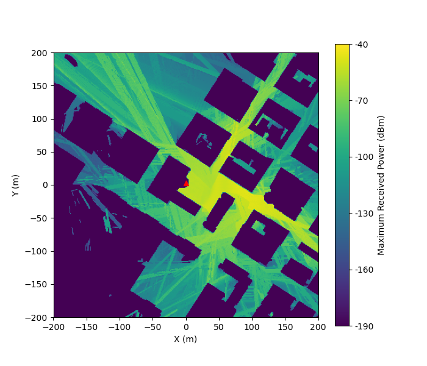

# Gr42EC431

## Group Team Members

- **Alagandula Nikhil Ganesh** - 202151017  
- **Ambati Hari Charan** - 202151019  
- **Kandukuri Maniveer** - 202151070  
- **Measala Namrath** - 202151089  

### Presentation Video

[Video Link](https://drive.google.com/drive/u/0/folders/1gKJ7a2lxHaNTPhHyVn9qiJaZE6ppFWmr)


# User Localization in 5G Networks Using Machine Learning

Welcome to the User Localization in 5G Networks project! This repository explores the use of machine learning techniques to enable precise user localization in 5G networks using Beamformed Fingerprints (BFFs). The project addresses the challenges of signal attenuation, multipath propagation, and non-line-of-sight (NLOS) conditions in millimeter-wave (mmWave) communications.

## 📖 Project Overview

With the advent of **5G networks** leveraging **mmWave technology**, there are unique challenges in signal propagation, especially in urban environments. The proposed solution involves **Beamformed Fingerprints (BFFs)** and advanced deep learning techniques to achieve accurate localization in both line-of-sight (LOS) and NLOS scenarios. The key features include:

- **Accurate Positioning**: Achieves high accuracy even in NLOS conditions.
- **Energy Efficiency**: Significantly reduces energy requirements compared to traditional methods.
- **Advanced Deep Learning Models**: Employs CNNs, HCNNs, and sequence-based models for localization.

## 📊 Visualization

### 1. Power Map Visualization
This visualization showcases the distribution of maximum received power across a simulated urban area.



### 2. Error Cumulative Histogram
The cumulative histogram illustrates the error distribution of the localization model, highlighting the 95th percentile and median errors.

[View Cumulative Histogram](./results/hist.pdf)

### 3. Example Beamformed Fingerprint
Below is a graphical representation of a beamformed fingerprint, highlighting spatial signal characteristics.

[View Beamformed Fingerprint](./results/bff_samples.pdf)


## ⚙️ Key Features

1. **Beamformed Fingerprints (BFFs):** Utilizes spatial and temporal characteristics of mmWave signals for localization.
2. **Deep Learning Models:** 
   - CNNs for spatial pattern recognition.
   - HCNNs for region-specific localization.
   - Sequence-based models (LSTMs, TCNs) for tracking device movement over time.
3. **Efficient Data Acquisition:** Predefined beamforming patterns and Power Delay Profile (PDP) sampling.

## 🚀 Getting Started

To set up and run the project locally, follow these instructions.

### Prerequisites

- **Hardware**
  - Nvidia GPU 
  - At least 16GB of RAM

- **Software**
  - Python 3.7 or higher.
  - TensorFlow 2.11.1
  - follow requirements.txt

### Installation

1. Clone the repository:

   ```bash
   git clone https://github.com/HariCharan-91/Gr42EC431--User-Localization.git
   pip install -e mmWave-localization-learning/
   cd user-localization-5g
   ```

2. Install the dependencies:

   ```bash
   pip install -r requirements.txt
   ```

3. Run the main scripts for preprocessing, training, and testing:

   ```bash
   python bin/preprocess_dataset.py path/to/config.yaml
   python bin/train_model.py path/to/config.yaml
   python bin/test_model.py path/to/config.yaml
   ```

## 🔄 Workflow

The project involves the following phases:

1. **Transmission Phase:** The base station transmits signals using predefined beamforming patterns.
2. **Reception Phase:** The mobile device captures the PDP data representing multipath signal reflections.
3. **Processing Phase:** Deep learning models analyze the BFF data to estimate the user’s location.
4. **Results Phase:** The position is outputted with high accuracy.

## 🔢 Performance Metrics

- **Localization Error:** Achieves an average error of 3.30m (non-tracking) and 1.78m (tracking) in realistic scenarios.
- **Energy Efficiency:** Demonstrates up to 85x efficiency compared to conventional GPS-based methods.
- **Scalability:** Efficient in handling dense urban environments.

## 🎯 Key Results

- **CNNs:** Achieved robust performance with an average error of 4.57m under low noise.
- **HCNNs:** Reduced average error to 3.31m with hierarchical segmentation.
- **Sequence Models:** Enhanced tracking accuracy in dynamic environments.

## 🔧 Future Work

- **AI-Driven Optimization:** Implement AI algorithms for dynamic resource allocation.
- **Multi-Access Edge Computing (MEC):** Explore edge computing to reduce latency further.
- **Enhanced Scalability:** Scale the system for larger urban deployments.


## 🔖 Contributions

- **Code Implementation:** Alagandula Nikhil Ganesh, Kandukuri Maniveer.
- **Research and Report Writing:** Ambati Hari Charan, Measala Namrath.

For questions or issues, feel free to reach out to the team members.
